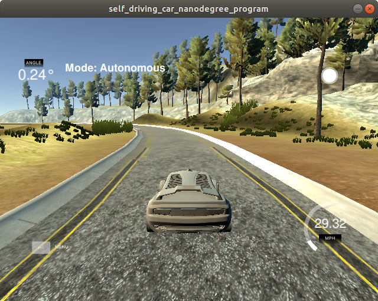
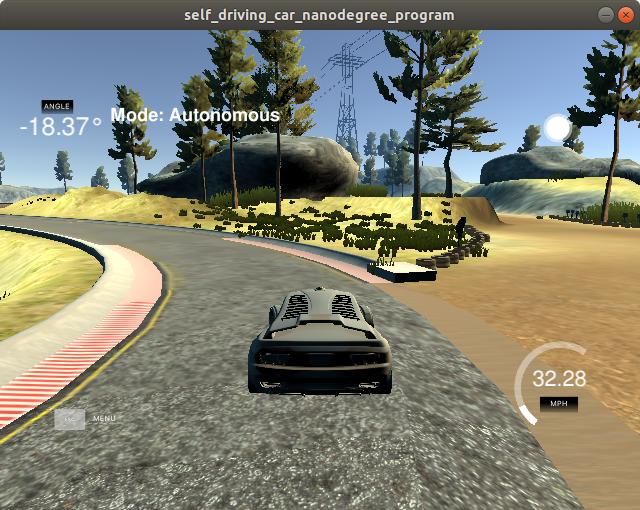
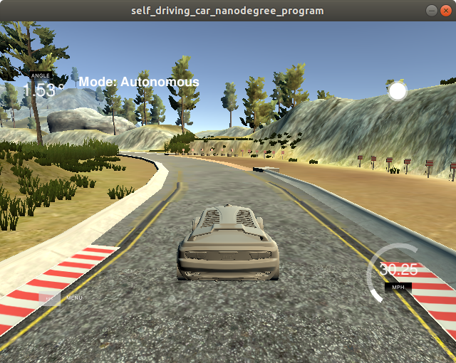
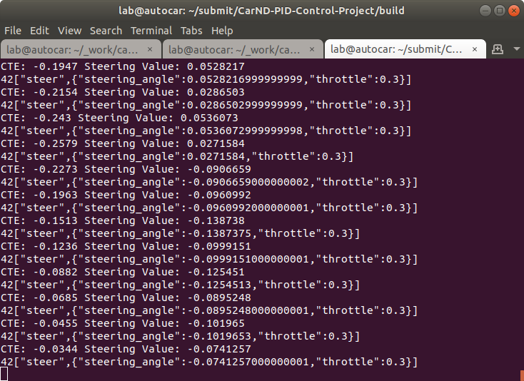

# CarND-Controls-PID
	Self-Driving Car Engineer Nanodegree Program

---
## Objective   
	The goal is to steering a car using PID controller without getting off the track. 

### Your code should compile. 
	Code must compile without errors with cmake and make. 

### The PID procedure follows what was taught in the lessons.  
	Manually tunned hyper parameters. 
    #### Manual hyperparameters tunning. 
     * Ideas is to get a first-hand feeling on how 'P', 'I', 'D' hyperparameters has actual effect on steering.
     * Hence the aim was not to quickly find best hyperparameters. For the same reason, I did not choose Twiddle algorithm. And used throttle = 0.3.
     * Some times I used same parameters again and again to get newer insights.
     * I am glad I tested manully many different hyperparameters, which has helped me get more understaing - on how hyperparameters are affecting the steering. 
     e.g. when the road is stright vs having sharp turns vs on bridge vs having marked sides, vs yelow lane markings vs no lane markings etc.
     
     
     
###  Describe the effect each of the P, I, D components had in your implementation. 
#### P (Proportional)  .
	Proportional- The output is proprotional to current error. The resulting error is multiplied with 'P' coefficient. 
    The rusult of appling P will result in zigzag motion and it will always overshoot.
  
#### D (Derivative): 
 	Derivative - The  output is proprotional to rate of change in error. The resulting error is multiplied with 'D' coefficient.
	It will help reduce overshoot due to nature of 'P', however it could cause slower conversion , jerks in steering. 

#### I (Integral): 
	Integral - The  output is proprotional sum of errors.  The resulting error is multiplied with 'I' coefficient. 
	The 'I' coefficient is smaller then 'I' and 'D'. This hyperparameter helps in converging faster 
	to smooth steering in reducing jerks and overshooting. 
        
    Hyperparameters are tunned mannually, Here are some of the trails.    
    - //  void PID::Init(double P, double I, double D)
    - //    pid.Init(1, 1, 1);//failed
    - //    pid.Init(1, 0, 0);//failed
    - //    pid.Init(1, 0, 1);//failed
    - //    pid.Init(1, 1, 0);//failed
    - //    pid.Init(1, .1, 1);//failed
    - //    pid.Init(.1, .1, 1);//failed
    - //    pid.Init(.1, .01, 1);//failed
    - //    pid.Init(.1, .01, .1);//failed
    - //    pid.Init(.1, .01, 2);//failed
    - //    pid.Init(.1, .01, 3);//failed
    - //    pid.Init(.1, .01, 4);//passing
    - //    pid.Init(.1, .001, 4);//failed
    - //    pid.Init(.1, .009, 4);//passing
    - //    pid.Init(.2, .009, 4);//passing
    - //    pid.Init(.2, .004, 3);//failed
    - //    pid.Init(.2, .0004, 1 );//passing
    - //    pid.Init(.12, .25, .00001);//failed
    - //    pid.Init(.1, .0001, 1.9);  //failed
    - //    pid.Init(.1, .0001, 2.9); //failed
    - //    pid.Init(.2, .0001, 1.9); //passing
    - //    pid.Init(.2, .0002, 1.9); //passing
    - //    pid.Init(.1, .0001, .6); //good 1
    - //    pid.Init(.1, .0001, .9); //good 2
    - //    pid.Init(.2, .0002, .3); //  0 --zigzag FAILED
    - //    pid.Init(.2, .0002, .9); //  still --zigzag
    - //    pid.Init(.2, .0002, 2.0); //   2 - close to edge of the road
    - //    pid.Init(1.2, .0002, 2.0);  // zigzag at curves  FAILED
    - //    pid.Init(1.2, .0002, 1.0);  // zigzag at curves  FAILED
    - //    pid.Init(1.2, .002, 1.0);   // zigzag at curves  FAILED
    - //    pid.Init(.05, .0002, 1.0); //  curves  FAILED
    - //    pid.Init(.05, .0002, .2); //  still bad on curves  FAILED
    - //    pid.Init(.05, .00002, .2); //  still bad on curves  FAILED
    - //    pid.Init(.05, .00002, .9); // still bad on curves  FAILED
    - //    pid.Init(.05, .002, .9); // zigzag  FAILED
    - //    pid.Init(.5, .002, .9); // more zigzag  FAILED
    - //    pid.Init(.5, .002, 2.0); // zigzag  but close to center FAILED
    - //    pid.Init(.5, .002, 3.0); // zigzag  but close to center FAILED
    - //    pid.Init(1.5, .002, 3.0); // zigzag   FAILED
    - //    pid.Init(1.5, .002, .9); // zigzag   FAILED
    - //    pid.Init(1.5, .00002, .9); // zigzag worst  FAILED
    - //    pid.Init(1.5, .0002, .9); // zigzag   FAILED
    - //    pid.Init(.5, .0002, .9); // still zigzag    FAILED
    - //    pid.Init(.5, .0002, .2); // still zigzag    FAILED
    - //    pid.Init(.5, .0001, .2); // still zigzag    FAILED
    - //    pid.Init(.2, .0001, .2); // still zigzag    FAILED
    - //    pid.Init(.2, .0001, .9); // still zigzag    FAILED
    - //    pid.Init(.1, .0001, .9); //  -- but still close to curve
    - //    pid.Init(.05, .0001, .9); //  -- but still close to curve FAILED
    - //    pid.Init(.05, .0001, .5); //  -- but still close to curve FAILED
    - //    pid.Init(.05, .0005, .5); //  -- but still close to curve FAILED
    - //    pid.Init(.05, .001, .5); //  -- but still close to curve FAILED
    - //    pid.Init(.08, .001, .5); //  -- but still close to curve FAILED
    - //    pid.Init(.08, .007, .5); //worst --   FAILED
    - //    pid.Init(.8, .007, .5);  //worst --   FAILED
    - //    pid.Init(.8, .007, 2.5);  //bettter --   FAILED
    - //    pid.Init(.8, .007, 1.5);  //worst --   FAILED
    - //    pid.Init(.8, .0007, 1.5);  //worst --   FAILED
    - //    pid.Init(.8, .00007, 1.5);  //worst --   FAILED
    - //    pid.Init(1.8, .00007, 1.5);  //worst --   FAILED
    - //    pid.Init(.1, .0001, 1.5);  //better --   FAILED
    - //    pid.Init(.2, .0001, 1.5);  //passing
    - //    pid.Init(.25, .0001, 1.5);  //passing more jerks
    - //    pid.Init(.25, .0003, 1.5);  //passing smoothened
    - //    pid.Init(.25, .0005, 1.5);  //passing smoothened
    - //    pid.Init(.2, .0005, 1.5);  //passing smoothened
    - //    pid.Init(.2, .0006, 1.5);  //passing smoothened
    - //    pid.Init(.2, .0009, 1.5);  //passing smoothened
    - //    pid.Init(.2, .001, 1.5);  //passing smoothened
    - //    pid.Init(.2, .001, 2.5);  //passing smoothened
    - //    pid.Init(.2, .001, 3.0);  //passing smoothened
    - //    pid.Init(.15, .001, 3.0);  //passing
    - //    pid.Init(.15, .001, 2.0);  //passing
    - //    pid.Init(.2, .001, 2.0);  //passing smoothened best so far
    - //    pid.Init(.2, .002, 2.0);  //passing smoothened
    - //    pid.Init(.25, .002, 2.0);  //passing smoothened
    - //    pid.Init(.25, .003, 2.0);  //passing zigzag
    - //    pid.Init(.25, .003, .9);  //passing zigzag
    - //    pid.Init(.20, .005, .9);  //passing zigzag
    - //    pid.Init(.20, .005, 2.0);  //passing zigzag
    - //    pid.Init(.10, .005, 2.0);  //passing zigzag
    - //    pid.Init(.10, .005, 3.0);  //passing
    - //    pid.Init(.07, .005, 3.0);  //passing  zigzag
    - //    pid.Init(.07, .007, 3.0);  //failed  zigzag
    - //    pid.Init(.27, .007, 3.0);  //failed  zigzag
    - //    pid.Init(.8, .007, 3.0);  //failed  zigzag
    - //    pid.Init(.8, .009, 3.0);  //failed  zigzag
    - //    pid.Init(.8, .009, .9);  //failed  zigzag
    - //    pid.Init(.8, .0009, .9);  //failed  zigzag
    - //    pid.Init(.8, .0009, 3.9);  //failed  zigzag
    - //    pid.Init(.8, .01, 3.9);  //failed  zigzag
    - //    pid.Init(.2, .01, 3.9);  //passing
    - //    pid.Init(.2, .01, 1.9);  //failed  zigzag
    - //    pid.Init(.2, .01, 4.9);  //passing
    - //    pid.Init(.2, .01, 5.9);  //passing
    - //    pid.Init(.2, .02, 5.9);  //failed  zigzag
    - //    pid.Init(.3, .01, 5.9);  //passing
    - //    pid.Init(.5, .01, 5.9);  //passing
    - //    pid.Init(.1, .01, 5.9);  //passing
    - //    pid.Init(.1, .01, 5.9);  //passing
    - //    pid.Init(.2, .01, 8.9);  //passing
    - //    pid.Init(.2, .01, 1.0);  //passing  jerks
    - //    pid.Init(.2, .04, 1.0);  //failed
    - //    pid.Init(.1, .04, 1.0);  //failed
    - //    pid.Init(1.0, .04, 1.0);  //passing  jerks
    - //    pid.Init(1.0, .4, 1.0);  //failed
    - //    pid.Init(5.0, .4, 1.0);  //failed
    - //    pid.Init(5.0, .4, 5.0);    //passing  jerks
    - //    pid.Init(.5, .04, 5.0);    //failed
    - //    pid.Init(.5, .08, 5.0);    //failed
    - //    pid.Init(.5, .08, 3.0);    //failed
    - //    pid.Init(.5, .08, .9);    //failed
    - //    pid.Init(.1, .08, .9);    //failed
    - //    pid.Init(.1, .008, .9);    //failed
    - //    pid.Init(.1, .008, 2.9);    //failed
    - //    pid.Init(.1, .0008, 2.9); //failed smoothened
    - //    pid.Init(.2, .0008, 2.9); //passing smoothened
    - //    pid.Init(.3, .0008, 2.9); //passing
    - //    pid.Init(.2, .0008, 1.9); //passing smoothened
    - //    pid.Init(.2, .0006, 1.9); //passing smoothened
    - //    pid.Init(.2, .0004, 1.9); //passing smoothened
    - //    pid.Init(.2, .0004, .9); //passing
    - //    pid.Init(.2, .0002, .9); //passing
    - //    pid.Init(.2, .0001, .9); //passing
    - //    pid.Init(.2, .001, .9); //passing smoothened
    - //    pid.Init(.2, .001, 2.9); //passing
    - //    pid.Init(.2, .001, 3.9); //passing
    - //    pid.Init(.25, .001, 3.9); //passing
    - //    pid.Init(.2, .001, 2.0);  //passing
    - //    pid.Init(.2, .001, 3.0);  //passing
    - //    pid.Init(.2, .008, 3.0);  //passing
    - //    pid.Init(.25, .006, 2.5);  //passing
    - //    pid.Init(.25, .003, 2.5);  //passing
    - //    pid.Init(.2, .009, 2.5);  //passing
    - //    pid.Init(.2, .0009, 2.5);  //passing
    - //    pid.Init(.15, .002, 2.5);  //passing
    - //    pid.Init(.15, .001, 2.5);  //passing
    - //    pid.Init(.2, .004, 3.5);  //passing
    - //    pid.Init(.2, .01, 3.9);  //passing
    - //    pid.Init(.2, .001, 3.9);  //passing
    - //    pid.Init(.2, .001, 2.9);  //passing
    - //    pid.Init(.2, .007, 2.9);  //passing
    - //    pid.Init(.2, .007, 1.9);  //passing
    - //    pid.Init(.2, .009, 2.9);  //passing
    - //    pid.Init(.2, .009, 1.9);  //passing
    - //    pid.Init(.25, .003, 2.5); //passing
    - //    pid.Init(.25, .007, 4.5); //passing
    - //    pid.Init(.2, .006, 4.5); //passing
    - //    pid.Init(.2, .009, 4.5); //passing
    - //    pid.Init(.15, .009, 0.7); //failed
    -    pid.Init(.2, .009, 2.5); //passing

### Describe the effect each of the P, I, D components had in your implementation.

    * try not going too close to the edges, specifically on sharp turns.
    * Algorithm to find steering ( = -P * p_error -D * d_error - I * i_error )
    
     * Effect of hyper paramerters observed duing manual tuning.
        
        * P (Proportional)  .
            *  Proportional- The 'P' coefficient was more effective between 0.1 to 0.25
         
        * D (Derivative): 
            * Derivative - The 'D' coefficient is more effective between 0.9 to 5. 
            
        * I (Integral): 
           *  Integral - The  'I' coefficient is more effective between 0.01 to 0.009.  

	







 
## Dependencies
	
    * cmake >= 3.5
     * All OSes: [click here for installation instructions](https://cmake.org/install/)
    * make >= 4.1(mac, linux), 3.81(Windows)
      * Linux: make is installed by default on most Linux distros
      * Mac: [install Xcode command line tools to get make](https://developer.apple.com/xcode/features/)
      * Windows: [Click here for installation instructions](http://gnuwin32.sourceforge.net/packages/make.htm)
    * gcc/g++ >= 5.4
      * Linux: gcc / g++ is installed by default on most Linux distros
      * Mac: same deal as make - [install Xcode command line tools]((https://developer.apple.com/xcode/features/)
      * Windows: recommend using [MinGW](http://www.mingw.org/)
    * [uWebSockets](https://github.com/uWebSockets/uWebSockets)
      * Run either `./install-mac.sh` or `./install-ubuntu.sh`.
      * If you install from source, checkout to commit `e94b6e1`, i.e.
        ```
        git clone https://github.com/uWebSockets/uWebSockets 
        cd uWebSockets
        git checkout e94b6e1
        ```
        Some function signatures have changed in v0.14.x. See [this PR](https://github.com/udacity/CarND-MPC-Project/pull/3) for more details.
    * Simulator. You can download these from the [project intro page](https://github.com/udacity/self-driving-car-sim/releases) in the classroom.
    
    Fellow students have put together a guide to Windows set-up for the project [here](https://s3-us-west-1.amazonaws.com/udacity-selfdrivingcar/files/Kidnapped_Vehicle_Windows_Setup.pdf) if the environment you have set up for the Sensor Fusion projects does not work for this project. There's also an experimental patch for windows in this [PR](https://github.com/udacity/CarND-PID-Control-Project/pull/3).

## Basic Build Instructions
	
    1. Clone this repo.
    2. Make a build directory: `mkdir build && cd build`
    3. Compile: `cmake .. && make`
    4. Run it: `./pid`. 
    
    Tips for setting up your environment can be found [here](https://classroom.udacity.com/nanodegrees/nd013/parts/40f38239-66b6-46ec-ae68-03afd8a601c8/modules/0949fca6-b379-42af-a919-ee50aa304e6a/lessons/f758c44c-5e40-4e01-93b5-1a82aa4e044f/concepts/23d376c7-0195-4276-bdf0-e02f1f3c665d)
    
## Editor Settings
	
    We've purposefully kept editor configuration files out of this repo in order to
    keep it as simple and environment agnostic as possible. However, we recommend
    using the following settings:
    
    * indent using spaces
    * set tab width to 2 spaces (keeps the matrices in source code aligned)

## Code Style

	Please (do your best to) stick to [Google's C++ style guide](https://google.github.io/styleguide/cppguide.html).

## Project Instructions and Rubric
	
    Note: regardless of the changes you make, your project must be buildable using
    cmake and make!

    More information is only accessible by people who are already enrolled in Term 2
    of CarND. If you are enrolled, see [the project page](https://classroom.udacity.com/nanodegrees/nd013/parts/40f38239-66b6-46ec-ae68-03afd8a601c8/modules/f1820894-8322-4bb3-81aa-b26b3c6dcbaf/lessons/e8235395-22dd-4b87-88e0-d108c5e5bbf4/concepts/6a4d8d42-6a04-4aa6-b284-1697c0fd6562)
    for instructions and the project rubric.

## Hints!
	
    * You don't have to follow this directory structure, but if you do, your work
      will span all of the .cpp files here. Keep an eye out for TODOs.

## Call for IDE Profiles Pull Requests
	
    Help your fellow students!
    
    We decided to create Makefiles with cmake to keep this project as platform
    agnostic as possible. Similarly, we omitted IDE profiles in order to we ensure
    that students don't feel pressured to use one IDE or another.
    
    However! I'd love to help people get up and running with their IDEs of choice.
    If you've created a profile for an IDE that you think other students would
    appreciate, we'd love to have you add the requisite profile files and
    instructions to ide_profiles/. For example if you wanted to add a VS Code
    profile, you'd add:
    
    * /ide_profiles/vscode/.vscode
    * /ide_profiles/vscode/README.md
    
    The README should explain what the profile does, how to take advantage of it,
    and how to install it.
    
    Frankly, I've never been involved in a project with multiple IDE profiles
    before. I believe the best way to handle this would be to keep them out of the
    repo root to avoid clutter. My expectation is that most profiles will include
    instructions to copy files to a new location to get picked up by the IDE, but
    that's just a guess.
    
    One last note here: regardless of the IDE used, every submitted project must
    still be compilable with cmake and make./

## How to write a README
	A well written README file can enhance your project and portfolio.  Develop your abilities to create professional README files by completing [this free course](https://www.udacity.com/course/writing-readmes--ud777).

